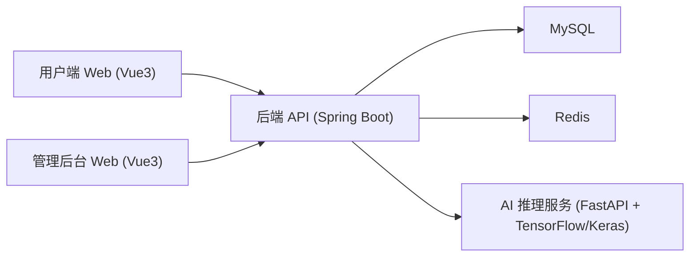

# 助农大米综合服务平台（Web 系统）

一个面向农业场景的多角色 Web 系统，核心目标是把“大米交易 + 农业交流 + 专家咨询 + AI 识别辅助”整合到同一平台。  
项目采用前后端分离架构，包含用户端、商户/管理员后台、Java 业务后端、AI 推理服务和数据库脚本。

## 项目定位

- 业务方向：助农电商 + 农业知识社区 + 专家协作
- 角色体系：普通用户、专家、商户、管理员
- 典型场景：商品浏览与下单、订单履约、论坛发帖与审核、AI 图像识别、在线消息沟通

## 系统架构



## 功能模块（按角色）

### 用户/专家端

- 登录注册、个人信息维护、头像上传
- 首页与专家工作台
- 商城：商品列表、店铺页、详情页、搜索与筛选
- 交易链路：购物车、结算、订单、收货地址、退款申请
- 社区：论坛发帖、评论互动、帖子详情
- AI：品种识别、病害识别、智能问答
- 私信：会话列表、消息交流

### 商户后台

- 商品管理：新增、编辑、上下架
- 订单管理：待发货、发货处理、售后处理
- 店铺经营页：经营概览、辅助分析
- 商户消息中心

### 管理员后台

- 用户管理：状态控制、密码重置
- 认证审核：商户/专家资质审核
- 内容审核：帖子与评论审核
- 系统配置：公告、分类、配置项维护
- 监控与数据管理相关功能

## 技术栈

- 前端：`Vue3 + Vite + Axios`
- 后端：`Spring Boot + Spring Security + MyBatis-Plus + MySQL + Redis`
- AI 服务：`FastAPI + TensorFlow/Keras`
- 鉴权方式：`JWT`（多角色权限控制）

## 近期后端修复

- 修复 `/api/products` 列表缓存 key 在空参数场景下的异常，恢复分页查询稳定性。
- 修复 `/api/shops` 列表缓存反序列化类型丢失问题，避免 `LinkedHashMap -> Page` 强转异常。
- 补充 `jackson-datatype-jsr310` 支持，确保 `LocalDateTime` 字段序列化兼容。

## 后端接口模块

后端控制器已按业务拆分，主要包括：

- `UserController`：注册登录、用户资料
- `ProductController` / `ShopController`：商品与店铺
- `CartController` / `OrderController` / `AddressController`：购物与订单链路
- `PostController` / `MessageController`：论坛与私信
- `MerchantController`：商户后台业务
- `AdminController` / `CertificationController`：管理员与审核业务
- `AIController`：AI 识别与问答能力接入

## 目录结构

```text
rice-web-system/
├── frontend-user/      # 用户端前端（含专家端页面）
├── frontend-admin/     # 管理后台前端（商户/管理员）
├── backend/            # Java 后端
├── ai-inference/       # AI 推理服务
└── database/           # 数据库脚本
```

## 运行环境与端口

- 用户端：`http://localhost:3000`
- 后台端：`http://localhost:3002`
- 后端 API：`http://localhost:8080`
- AI 推理服务：`http://localhost:8001`（默认）

## 本地启动步骤

1. 启动基础依赖：MySQL、Redis
2. 初始化数据库：执行 `database/` 下 SQL 脚本
3. 启动后端服务：

```bash
cd backend
mvn spring-boot:run
```

4. 启动 AI 服务：

```bash
cd ai-inference
pip install -r requirements.txt
python app.py
```

5. 启动用户端：

```bash
cd frontend-user
npm install
npm run dev
```

6. 启动后台端：

```bash
cd frontend-admin
npm install
npm run dev
```
